# Body Fat Percent Calculator

Body Fat Percent Calculator is a Python-based application designed to calculate a user's body fat percentage using the Jackson/Pollock 7-Site Caliper Method. The calculator provides an interactive terminal interface, guiding users through the process of entering their personal measurements, including weight, age, gender, and skinfold measurements taken with a caliper. Users are presented with a summary of the calculations, which includes body fat percentage, body fat mass, lean body mass, and recommendations based on the user's body fitness levels. Additionally, collected data and results are stored securely via Google Sheets, ensuring privacy and ease of access for future reference.

## Goal & Target Audience

The primary goal of this application is to provide users with a detailed analysis of their body composition, specifically focusing on body fat percentage, body fat weight, and lean body mass. The target audience includes fitness enthusiasts, health-conscious individuals, and anyone interested in obtaining a comprehensive understanding of their body fat composition for health or fitness planning.

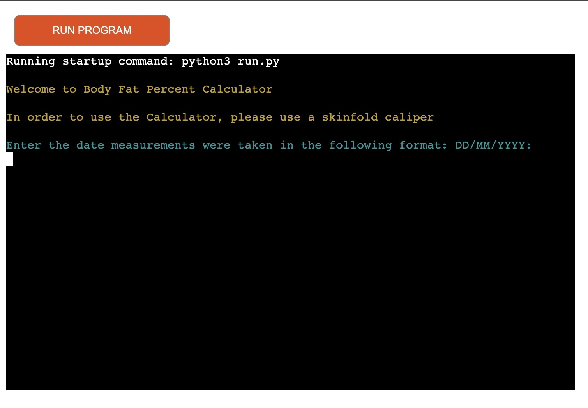

### Project Links

[Live Site](https://body-fat-percent-calculator-5ad0ac04aebf.herokuapp.com/)

## UX Design

### User Experience

Upon starting the application, users are greeted with a clear introduction and prompted to input their details, including the date measurements were taken, name, gender, age, weight, and specific skinfold measurements. Instructions for taking accurate measurements are provided to ensure data reliability. After all inputs are validated and submitted, the application calculates and displays the user's body fat percentage, body fat weight, and lean body mass. At the end recommendations based on the user's body composition are provided.

### User Stories

***First Time User:*** A new user can easily navigate through the application by following on-screen instructions to input their personal measurements and receive their body composition analysis.

***Returning / Frequent User:*** Users returning to the application can input new measurements to track changes in their body composition over time and have option to skip procedure and measurements instructions.

***Interested Parties:*** Health and fitness professionals can use the application to assist clients in understanding their body composition and developing personalised fitness plans.

## Logic

The application's logic flows as follows:

1. User inputs are collected through a series of prompts (date, name, gender, age, weight, skinfold measurements).
2. Each input is validated for format and plausibility.
3. Upon successful validation, the data is stored in a Google Sheets document in 'measurements' worksheet, ensuring user data privacy and easy access for future reference.
4. The application calculates the body fat percentage, body fat weight, and lean body mass using the provided data.
5. Results are displayed to the user.
6. The calculated results are stored in a Google Sheets document in a woeksheet called 'results'.
7. Summary and personalised recommendations and presented to the user.
8. User is given the option to run the program again or exit.

### Application Logit Flow Chart

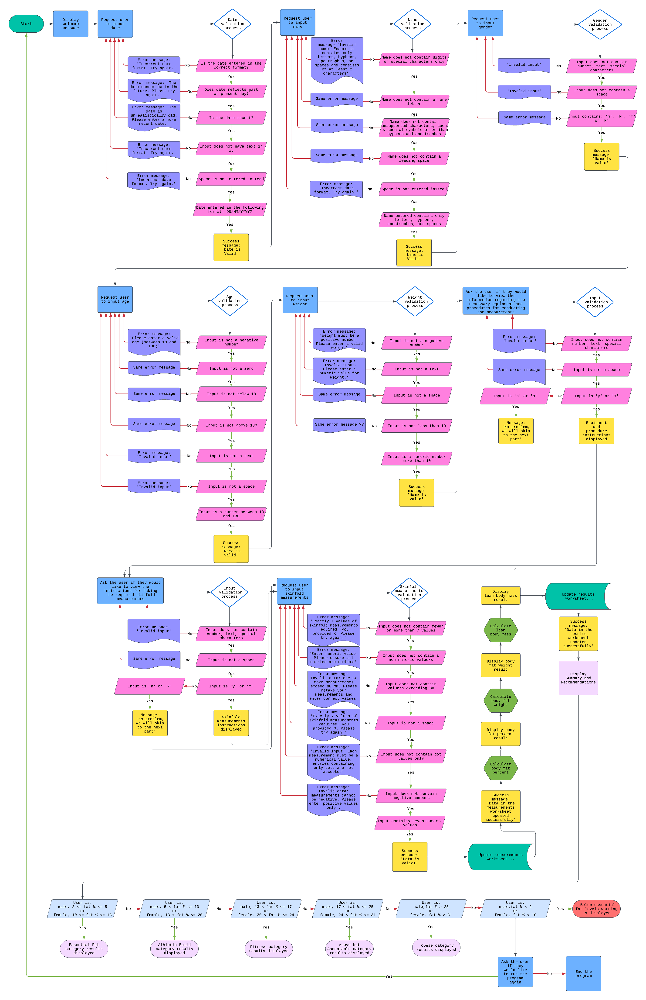

## Data Model

The Data Model of the Body Fat Percent Calculator is designed to efficiently organize, validate, and process user inputs, calculating body fitness levels to provide results and recommendations. It integrates Python packages to offer a secure and user-friendly experience, focusing on two main components:

- **Google Sheets Integration via `gspread`.** It is essential for the application's interaction with Google Sheets, where data is stored. This method offers a secure, accessible, and manageable solution for storing user inputs and calculated outcomes. This setup enhances data clarity and facilitates progress tracking over time. Cloud-based storage guarantees data backup and accessibility, ensuring privacy and convenience for users.

- **Terminal Interface Enhancement with `colorama`.** It improves user interaction by utilising the `colorama` package to output colored text in the terminal, making the interface more engaging and easy to navigate. Color differentiation helps highlight application sections, error messages, and instructions, boosting readability and user engagement.

- **Data Validation.** Every user input undergoes a thorough validation process for accuracy and reliability, using regular expressions and custom logic tailored to each input type. This step verifies date, name, gender, and numerical inputs against specific formats and ranges, and it is crucial for maintaining data integrity and ensuring precise calculations.

- **Processing and Calculation Logic.** After validation, the application employs the Jackson/Pollock 7-Site Caliper Method for calculations, enabling users to receive insightful and accurate body composition assessments.

The integration of these components forms the foundation of the application's functionality, from data entry to result calculation, guaranteeing data integrity and a seamless user experience.

### Data Storage

User's data and calculated results are stored in a Google Sheets document, organised into two worksheets: 'measurements' and 'results'. This allows to segregate different types of data while ensuring they remain accessible and manageable. The docu,emt can be accessed [here](https://docs.google.com/spreadsheets/d/1wtBIdRfhVgiLtt7POK6Ok7haC94J2Ui8iBBVCPcYop4/edit#gid=0).

- **Measurements Worksheet.** This worksheet is dedicated to storing raw user inputs. Each entry includes the date of measurement, user name, gender, age, weight, and the specific skinfold measurements. By collecting this data, the application lays the groundwork for the following body composition calculation and analysis. The design of this worksheet facilitates the tracking of individual progress over time, as users can input new measurements and compare them against their historical data.

- **Results Worksheet.** After processing the user's measurements, the calculated results – body fat percentage, body fat mass, lean body mass – are stored in the 'results' worksheet. This separation of raw data from calculated results simplifies data analysis and allows for a clear overview of the user's body composition trends over time. 

- **Data Privacy and Security.** Utilising Google Sheets for data storage ensures user data is protected against unauthorised access. 

- **Ease of Management.** By storing data in Google Sheets, the application enables easy data management, analysis, and sharing capabilities.


### Python Packages Used

- `gspread`: Enables the application to interact with Google Sheets, facilitating the storage and retrieval of user data and calculated results. This package is crucial for the application’s data storage model, providing a bridge between the Python application and Google's cloud storage.

- `google.oauth2.service_account`: Used for authenticating with the Google Sheets API, ensuring secure access to the application's data storage solution. It allows the application to maintain high standards of data security and privacy.

- `datetime`: Supports handling and validation of date inputs, crucial for tracking the timing of measurements and ensuring data relevance.

- `re` (Regular Expressions): Utilised for validating user inputs, such as name value, to ensure it meets predefined formats and criteria. 

- `colorama`: Enhances the terminal interface by adding color to text, improving user experience by making the interface more engaging and easier to navigate. It plays a significant role in user interaction without directly affecting the data model or storage.

## Features

### Existing Features

***1. Initialisation of Libraries and Google Sheets API***

Upon starting, the application initializes necessary libraries (gspread, google.oauth2, datetime, re, colorama) and sets up Google Sheets API credentials. It automatically authenticates with Google's servers using a service account, opens a specified Google Sheet ("body-fat-percent-calculator"), and prepares the application for user interaction. This process runs in the background, and no feedback is provided to the user, apart from issues with network access.

***2. Welcome Message***

Once the terminal loads, the user is greeted with a welcome message and informed that a skinfold caliper needs to be used in order to use this calculator:

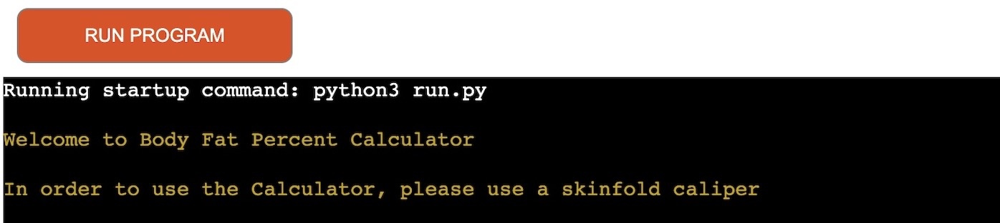

***3. Measurements Date Input***

Next, the user is requested to input the date when measurements were taken, expecting a specific format (DD/MM/YYYY). This allows returning users to compare their measurements by date when having access to the Google Sheet.

The entered data is validated to ensure it matches the required format and that text or spaces are not entered instead. It also checks if the date is within a realistic range.

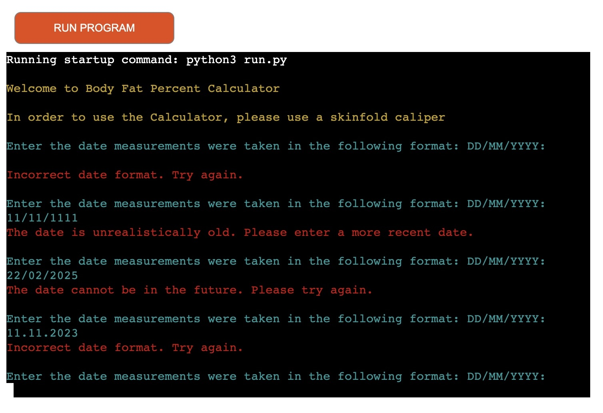

When the date is entered in the required format, the user receives a success message: "Date is valid!"

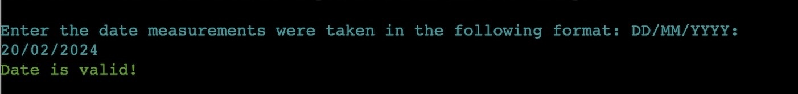

***4.  User Name Input***

After that, the user is requested to provide their name, which must only contain letters, hyphens, apostrophes, and spaces, and be at least 2 characters long. If the name contains digits, special characters only, unsupported characters (such as special symbols other than hyphens and apostrophes), leading space, space only, or is just one letter, the user receives an error message:

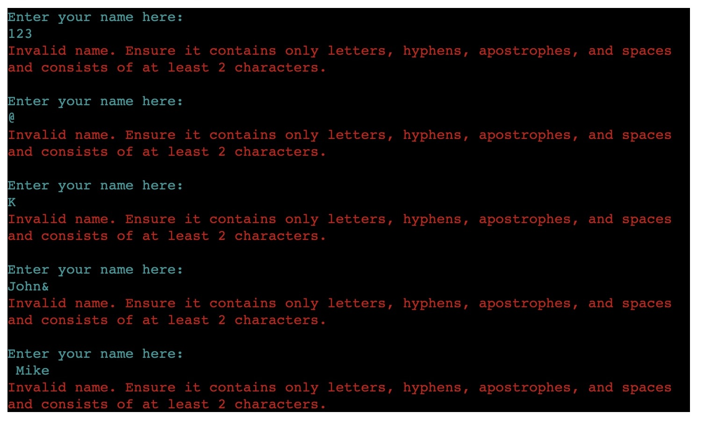

Upon providing a name in the required format, the user receives a success message: "Name is valid!"


***5. User Gender Input***

Next, the user is prompted to specify their gender by entering "M" for male or "F" for female, ensuring that the application can provide more personalized feedback or calculations based on gender-specific data.

The application checks the user's input against the accepted values ("M" or "F"). This validation is case-insensitive to enhance usability, accepting both uppercase and lowercase inputs. If the input deviates from these two options, the application responds with "Invalid input. Please enter 'M' for male or 'F' for female."

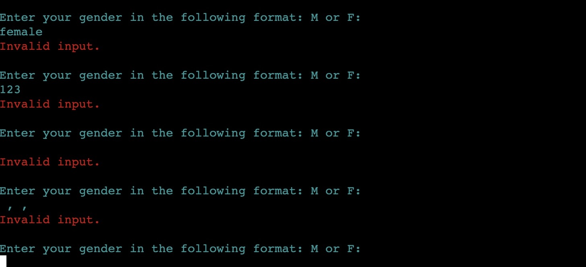

If the user enters "M" or "F" (regardless of case), the application confirms with "Gender is valid!" and proceeds.


***6. User Age Input***

Next, the user is requested to input their age, which must be a positive integer within the range of 18 to 130 years. The entered age is validated to ensure it is a numeric value and falls within the acceptable age range. The validation checks that the age is not a negative number or zero, and that it is not entered as text. Relevant error messages are provided accordingly.

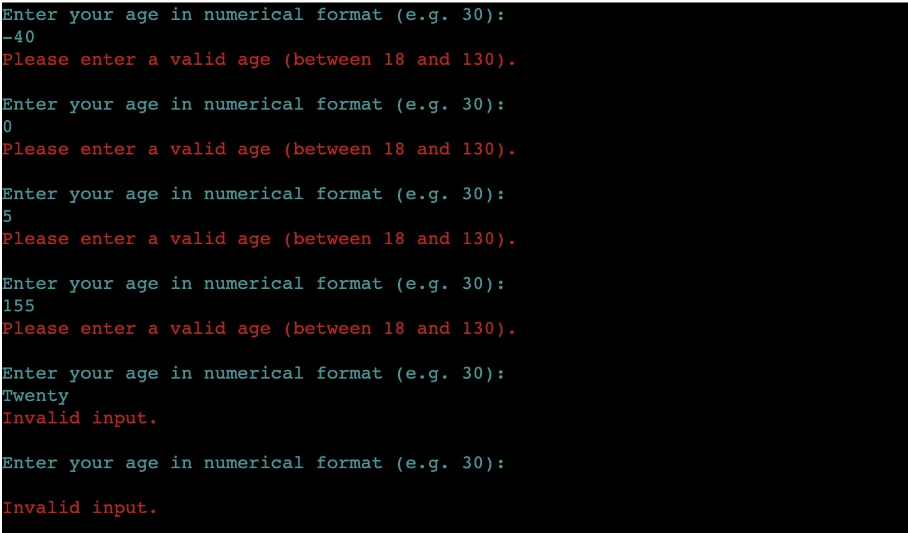

If the age is entered in the required format, a success message displayed "Age is valid!" indicates the input meets the criteria.


***7. User Weight Input***

Next the application gathers the user's weight in kilograms, supporting decimal inputs to accommodate precise measurements. The entered weight is validated to check if it is a positive decimal or integer greater than 10kg, ensuring the value is realistic and suitable for further calculations.

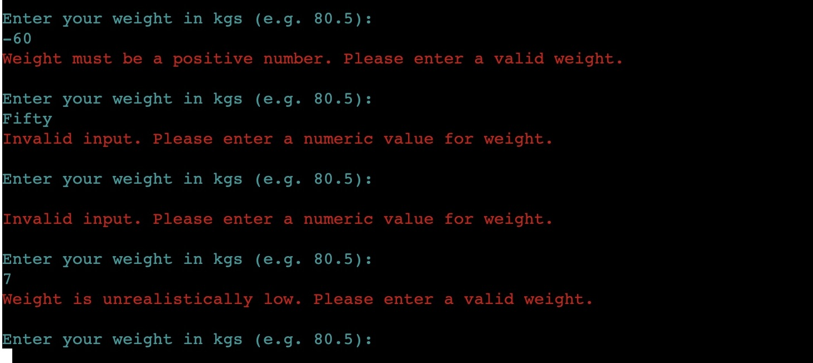

Upon entering weight in the required format, the user receives a success message: "Weight is valid!"

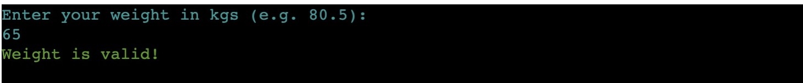

***8. Equipment and Procedure to conduct measurements***

The application provides the user with an option to access instructions on the procedure of taking skinfold measurements and what equipment is needed.
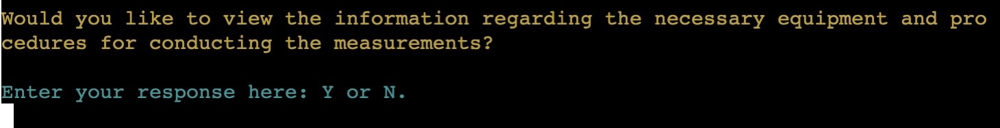

User is prompted to decide whether they wish to view these instructions. Choosing "Yes" displays further instructions:

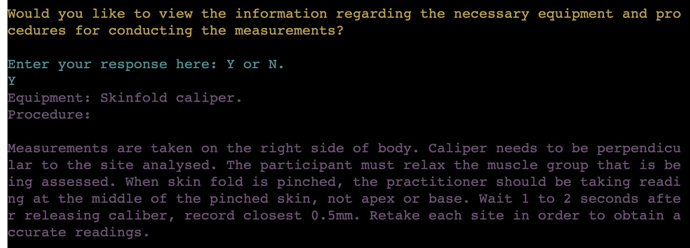

Selecting "No" skips to the next step.

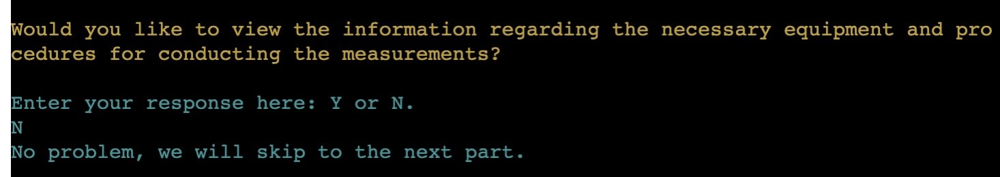

***9. Skinfold Measurements Instructions***

Next, the user is offered the opportunity to review specific instructions on how to measure each skinfold to ensure accurate measurements are taken in the right parts of the body.


The user is again prompted to decide whether they wish to view these instructions with "Y" for yes or "N" for no.

Opting in displays comprehensive procedural instructions and tips for taking accurate skinfold measurements.


Opting out acknowledges the user's choice and proceeds to the next step.

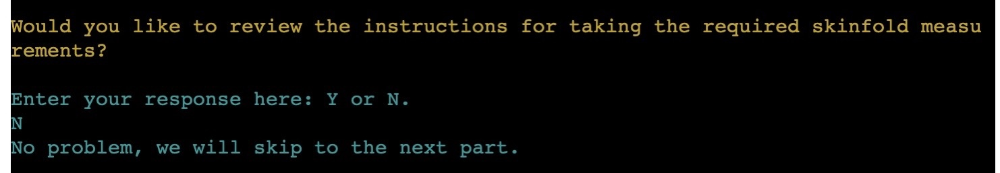


### Future Features

- Data Trends Analysis: this feature would allow the analysis of changes in body composition over time for returning users. This feature could provide insights into how their physical attributes have evolved, enabling more personalised health and fitness recommendations.

- Expanded Measurement Methods: additional methods for calculating body composition could be incorporated to cater to a wider audience. This developemt could ensure that service is accessible and relevant to individuals with diverse needs and preferences.

- Enhanced Data Management: to support health and fitness professionals in managing their clients' progress, storing data for different users separately could be inroduced. This could streamline the tracking of each client's journey, facilitating more effective coaching and support.


## Testing

Here's a proofread version of your text:

Numerous tests were performed to ensure the proper functionality of the Body Fat Percent Calculator application.

The application was tested in various browsers: Chrome, Microsoft Edge, Firefox, and Brave, and no issues were identified with its functionality or loading time.

The project was tested on multiple desktop devices with different screen dimensions, and no issues were identified.

### Testing behaviour

Each input field and feature of the Body Fat Percent Calculator application were thoroughly tested to ensure accurate functionality of the app and high standard validation.

Action/Feature          | Expected behavior       | Status         |
|-------------------|-------------------------|----------------|
|Enter URL: <https://body-fat-percent-calculator-5ad0ac04aebf.herokuapp.com/> | Page loads with the terminal displaying the following message: 'Running startup command: python3 run.py. Welcome to Body Fat Percent Calculator. In order to use the Calculator, please use a skinfold caliper. Enter the date measurements were taken in the following format: DD/MM/YYYY:' | Pass |
|Testing date input field |
|Enter an invalid date format (e.g., “15-03-2024” or “03/15/2024”) | The program displays an error message: 'Incorrect date format. Try again.' The user is offered again to enter the date measurements were taken in the following format: DD/MM/YYYY.| Pass |
|Enter a date that is in the future (e.g., “20/05/2025”) | The program displays an error message: 'The date cannot be in the future. Please try again.' The user is offered again to enter the date measurements were taken in the following format: DD/MM/YYYY. | Pass |
|Enter a date that is in the distant past (e.g., “01/01/1800”) | The program displays an error message: 'The date is unrealistically old. Please enter a more recent date.' The user is offered again to enter the date measurements were taken in the following format: DD/MM/YYYY. | Pass |
|Enter text into the input field for the date | Error message is displayed: ‘Incorrect date format. Try again.’ The user is offered again to enter the date measurements were taken in the following format: DD/MM/YYYY. | Pass |
|Enter a space into the input field for the date | Entering only a space results in error message being displayed: ‘Incorrect date format. Try again.’ The user is offered again to enter the date measurements were taken in the following format: DD/MM/YYYY. | Pass |
|Enter a date in a non-leap year (e.g., “29/02/2023”) | The program displays an error message: “Incorrect date format. Try again.” The user is offered again to enter the date measurements were taken in the following format: DD/MM/YYYY. | Pass |
|Enter a valid date in the format 'DD/MM/YYYY' | The date is accepted, the program displays a message 'Date is valid!' and proceeds. | Pass |
Enter a date in a leap year (e.g., “29/02/2020”) | The date is accepted, the program displays a message 'Date is valid!' and proceeds. | Pass |
|Testing name input field |
|Enter a name that contains no letters (e.g., digits or special characters only). | The program displays an error message: 'Invalid name. Ensure it contains only letters, hyphens, apostrophes, and spaces and consists of at least 2 characters'. The user is offered to enter name again. | Pass |
|Enter a name with fewer than 2 characters (e.g. 'A'). | The program displays the same error message “Invalid name. Ensure it contains only letters, hyphens, apostrophes, and spaces and consists of at least 2 characters”.  The user is offered to enter name again. | Pass |
|Enter a name containing unsupported characters, such as special symbols other than hyphens and apostrophes (e.g. 'Tom@Smith') | The program displays the same error message “Invalid name. Ensure it contains only letters, hyphens, apostrophes, and spaces and consists of at least 2 characters”.  The user is offered to enter name again. | Pass |
|Enter a name with a leading space (e.g. ' Jane') | The program displays the same error message “Invalid name. Ensure it contains only letters, hyphens, apostrophes, and spaces and consists of at least 2 characters”.  The user is offered to enter name again. | Pass |
|Enter a space in the name input field | Entering only a space results in the program displaying the same error message “Invalid name. Ensure it contains only letters, hyphens, apostrophes, and spaces and consists of at least 2 characters”.  The user is offered to enter name again. | Pass |
|Enter a valid name containing only letters, hyphens, apostrophes, and spaces. | The name is accepted, the program displays a message 'Name is valid!' and proceeds. | Pass |
|Testing gender input field |
|Enter any input other than 'm', 'M', 'f' or 'F' (e.g., number, text) | The program displays an error message: “Invalid input.” The user is offered to enter their gender in the following format: M or F. | Pass |
|Enter space in the gender input field | Entering only a space results in the program displaying an error message: “Invalid input.” The user is offered to enter their gender in the following format: M or F. | Pass |
Enter 'm', 'M', 'f' or 'F' | The gender is accepted, the program displays a message 'Gender is valid!' and proceeds. | Pass |
|Testing age input field |
|Enter a negative age (e.g., '-10') | The program displays an error message: 'Please enter a valid age (between 18 and 130)'. The user is offered to enter age in numerical format (e.g. 30) | Pass |
|Enter zero as the age | The program displays an error message: 'Please enter a valid age (between 18 and 130)'. The user is offered to enter age in numerical format (e.g. 30) | Pass |
|Enter age below 18 (e.g. '15') | The program displays an error message: 'Please enter a valid age (between 18 and 130)'. The user is offered to enter age in numerical format (e.g. 30) | Pass |
|Enter age above 130 (e.g. 150) | The program displays an error message: 'Please enter a valid age (between 18 and 130)'. The user is offered to enter age in numerical format (e.g. 30) | Pass |
|Enter a non-numeric input (e.g., 'twenty') | The program displays an error message: 'Invalid input.' The user is offered to enter age in numerical format (e.g. 30) |
|Enter space to the age input field | Entering only a space results in the program displaying an error message: 'Invalid input.' The user is offered to enter age in numerical format (e.g. 30) |
|Enter a valid age between 18 and 130 (e.g., '30'). | The age is accepted, the program displays a message 'Age is valid!' and proceeds. | Pass |
|Testing weight input field |
|Enter a negative weight (e.g., '-5') | The program displays an error message: 'Weight must be a positive number. Please enter a valid weight'. The user is offered to enter weight in kgs (e.g. 80.5). | Pass |
|Enter a non-numeric input (e.g., 'fifty') | The program displays an error message: 'Invalid input. Please enter a numeric value for weight.' The user is offered to enter weight in kgs (e.g. 80.5). | Pass |
|Enter a space into the weight input field | Entering only a space results in the program displaying an error message: 'Invalid input. Please enter a numeric value for weight.' The user is offered to enter weight in kgs (e.g. 80.5). | Pass |
|Enter a valid weight greater than 10 (e.g., '80.5') | The weight is accepted, the program displays a message 'Weight is valid!'and proceeds | Pass |
|Testing procedure instructions display |
|Enter any input other than 'y','Y', 'n' or 'N' (e.g., number, special character, text) | The program displays an error message: 'Invalid input'. The user is asked if they would like to view the information regarding the necessary equipment and procedures for conducting the measurements and offered to provide response in the following format Y or N. | Pass |
|Enter a space into the input field | Entering only a space results in the program displaying an error message: 'Invalid input'. The user is asked if they would like to view the information regarding the necessary equipment and procedures for conducting the measurements and offered to provide response in the following format Y or N. | Pass |
|Enter 'y' or 'Y' to view the instructions | The program displays the equipment and procedure instructions. | Pass |
|Enter 'n' or 'N' to skip viewing the instructions | The program acknowledges the choice with the following message: 'No problem, we will skip to the next part' and proceeds. | Pass |
|Testing skinfold measurements instructions display |
|Enter any input other than 'y','Y', 'n' or 'N' (e.g., number, special character, text) | The program displays an error message: 'Invalid input'. The user is asked if they would like to review the instructions for taking the required skinfold measurements and offered to provide response in the following format Y or N. | Pass |
|Enter a space into the input field | Entering only a space results in the program displaying an error message: 'Invalid input. The user is asked if they would like to review the instructions for taking the required skinfold measurements and offered to provide response in the following format Y or N. | Pass |
|Enter 'y' or 'Y' to view the instructions | The program displays the skinfold measurements instructions. | Pass |
|Enter 'n' or 'N' to skip viewing the instructions | The program acknowledges the choice with the following message: 'No problem, we will skip to the next part' and proceeds. | Pass |
|Testing skinfold measurements input field |
|Enter fewer or more than 7 values into the measurements input field(e.g., '10 15 12' or '11 20 12 10.7 9.5 20 18 35 45.5') | The program displays an error message: 'Exactly 7 values of skinfold measurements required, you provided X. Please try again.' The user is offered to attempt enterign skinfolds again. | Pass |
|Enter non-numeric values (e.g., 'hello 5 12 11.7 25 20 33') | The program displays an error message: 'Enter numeric value. Please ensure all entries are numbers'.  The user is offered to attempt enterign skinfolds again. | Pass |
|Enter measurements exceeding 80 mm (e.g., '90 70 85 95 100 80 75') | The program displays an error message: 'Invalid data: one or more measurements exceed 80 mm. Please retake your measurements and enter correct values'.  The user is offered to attempt enterign skinfolds again. | Pass |
|Enter only spaces into the input field | Entering only spaces results in the program displaying an error message: 'Exactly 7 values of skinfold measurements required, you provided 0. Please try again.'  The user is offered to attempt enterign skinfolds again.| Pass |
|Enter only commas into the input field | Entering only commas results in the program displaying an error message: 'Exactly 7 values of skinfold measurements required, you provided 0. Please try again.'  The user is offered to attempt enterign skinfolds again.| Pass |
|Enter dot values only (e.g. ...  .. .. ..) | Entering only dots results in the program displaying an error message: 'Invalid input. Each measurement must be a numerical value, entries containing only dots are not accepted'.  The user is offered to attempt enterign skinfolds again. | Pass |
|Enter skinfold measurements with negative values (e.g. -25,11 34 55 55 -6 8) | The program displays an error message: 'Invalid data: measurements cannot be negative. Please enter positive values only'. The user is offered to attempt enterign skinfolds again. | Pass |
|Enter valid skinfold measurements in the correct format (e.g., '10.5 5 12 11.7 25 20 33') | The measurements are accepted, the program displays a message 'Data is valid!'and proceeds | Pass |
|Testign recommendations display |
|Essential Fat Category |
|Men: Enter age 25, 'M' for gender, 60 for weight and the following skinfold measurements: '3.5, 11.0, 3.0, 3.0, 3.5, 3.3, 1.3' | The body fat percent, body fat weight and lean body mass are calculated and displayed. User presented with the Summary and Recommendations indicating an Essential Fat category. | Pass |
|Women: Enter age 25, 'F' for gender, 60 for weight and the following skinfold measurements: '6.4, 5.5, 2.2, 4.1, 2.0, 22.3, 1.6' | The body fat percent, body fat weight and lean body mass are calculated and displayed. User presented with the Summary and Recommendations indicating an Essential Fat category. | Pass |
|Athletic Build Category |
|Men: Enter age 25, 'M' for gender, 60 for weight, and the following skinfold measurements: '6.9, 4.9, 4.4, 32.9, 3.9, 7.0, 8.2' | The body fat percent, body fat weight, and lean body mass are calculated and displayed. User presented with the Summary and Recommendations indicating an Athletic Build category. | Pass |
|Women: Enter age 25, 'F' for gender, 60 for weight, and the following skinfold measurements: '5.0, 7.4, 7.8, 6.4, 25.3, 7.8, 4.5' | The body fat percent, body fat weight, and lean body mass are calculated and displayed. User presented with the Summary and Recommendations indicating an Athletic Build category. | Pass |
|Fitness Category |
|Men: Enter age 25, 'M' for gender, 60 for weight, and the following skinfold measurements: '5.9, 62.2, 4.2, 8.2, 6.8, 3.4, 4.9' | The body fat percent, body fat weight, and lean body mass are calculated and displayed. User presented with the Summary and Recommendations indicating a Fitness category. | Pass |
|Women: Enter age 25, 'F' for gender, 60 for weight, and the following skinfold measurements: '8.8, 11.1, 4.7, 7.9, 39.5, 12.6, 14.2' | The body fat percent, body fat weight, and lean body mass are calculated and displayed. User presented with the Summary and Recommendations indicating a Fitness category. | Pass |
|Above but Acceptable Category |
|Men: Enter age 25, 'M' for gender, 60 for weight, and the following skinfold measurements: '15.2, 7.5, 12.9, 19.7, 34.8, 16.0, 16.4' | The body fat percent, body fat weight, and lean body mass are calculated and displayed. User presented with the Summary and Recommendations indicating an Above but Acceptable category. | Pass |
|Women: Enter age 25, 'F' for gender, 60 for weight, and the following skinfold measurements: '13.7, 19.0, 12.6, 11.6, 28.9, 32.7, 14.5' | The body fat percent, body fat weight, and lean body mass are calculated and displayed. User presented with the Summary and Recommendations indicating an Above but Acceptable category. | Pass |
|Obese Category |
| Men: Enter age 25, 'M' for gender, 60 for weight, and the following skinfold measurements: '38.1, 39.5, 22.3, 29.0, 33.1, 29.2, 22.8' | The body fat percent, body fat weight, and lean body mass are calculated and displayed. User presented with the Summary and Recommendations indicating an Obese category. | Pass |
| Women: Enter age 25, 'F' for gender, 60 for weight, and the following skinfold measurements: '33.0, 39.0, 23.7, 29.9, 21.0, 23.9, 26.2' | The body fat percent, body fat weight, and lean body mass are calculated and displayed. User presented with the Summary and Recommendations indicating an Obese category. | Pass |
|Below Essential Fat Category |
|Men: Enter age 25, 'M' for gender, 60 for weight, and the following skinfold measurements: '2.4, 5.8, 1.9, 1.2, 1.9, 2.1, 1.8' | The body fat percent, body fat weight, and lean body mass are calculated and displayed. User presented with the Summary and Recommendations indicating a Below Essential Fat category. | Pass |
|Women: Enter age 25, 'F' for gender, 60 for weight, and the following skinfold measurements: '4.0, 14.6, 3.6, 4.4, 2.1, 1.3, 3.7' | The body fat percent, body fat weight, and lean body mass are calculated and displayed. User presented with the Summary and Recommendations indicating a Below Essential Fat category. | Pass |
|Testing 'would you like to run the program again' input field|
|Enter any input other than 'y','Y', 'n' or 'N' (e.g., number, text, special character or space) | The program displays an error message: 'Invalid input. Please enter Y or N'. The user is asked if they would like to run the program again and offered to provide a response in the following format: Y or N. | Pass |
|Enter a space into the input field | Entering only a space results in the program displaying an error message: : 'Invalid input. Please enter Y or N'. The user is asked if they would like to run the program again and offered to provide a response in the following format: Y or N. | Pass |
|Enter 'y' or 'Y' to run the program again | The program starts from the beggining and welcome message is displayed. | Pass |
|Enter 'n' or 'N' to end the program | The program acknowledges the choice with the following message: 'The program has ended. Thank you for using the Body Fat Percent Calculator'. | Pass |

### Validator Testing
To align with web standards and ensure accessibility compliance Python code was tested through [PEP8 Python Validator](https://pep8ci.herokuapp.com). Five errors were identified, as described below.

**1. E501: Line Too Long (93 > 79 characters)**
- Description: This error occurs when a line exceeds the recommended maximum length of 79 characters.
- Resolution: Lines with such error were broken into multiple lines using parentheses as per instructions from [ Stack Overflow](https://stackoverflow.com/questions/53158284/python-giving-a-e501-line-too-long-error?noredirect=1).

**2. E128: Continuation Line Under-Indented for Visual Indent**
- Description: This error occurs when a continuation line (following an opening parenthesis) is not indented correctly.
- Resolution: It was ensured that continuation lines with such error are indented to the same level as the opening parenthesis as per instructions from [Stack Overflow](https://stackoverflow.com/questions/15435811/what-is-pep8s-e128-continuation-line-under-indented-for-visual-indent).

**3. W291: Trailing Whitespace**
- Description: This warning indicates that there are extra spaces or tabs at the end of a line.
- Resolution: All the trailing whitespaces were removed from the end of each line with such an error as per instruction form [Stack Overflow](https://stackoverflow.com/questions/21410075/what-is-trailing-whitespace-and-how-can-i-handle-this).

**4. E127: Continuation Line Over-Indented for Visual Indent**
- Description: This error occurs when a continuation line is indented farther than it should be for a visual indent.
- Resolution: The indentations of the continuation lines were adjusted to align with the opening delimiter of the construct they belong to as per instruction from [Stack Overflow](https://stackoverflow.com/questions/21947121/pep8-continuation-line-over-indented-for-visual-indent).

**5. E712: Comparison to False Should Be ‘if cond is False’**
- Description: This error occurs when comparing a value to False using the == operator.
- Resolution: 'if not cond:' was used instead of 'if cond == False:' as per instructions from [Stack Overflow](https://stackoverflow.com/questions/54474042/how-to-fix-the-flake-8-error-e712-comparison-to-false-should-be-if-cond-is-fal).


### Bugs

#### Solved Bugs

##### ***Issue 1***

After adding Colorama module Python package to the code to be able to change text color and improve user experience, the project was successfully running locally in Gitpod. However after the deployment the following error was identified: 'ModuleNotFoundError'.

```Traceback (most recent call last):
  File "/app/run.py", line 5, in <module>
    from colorama import init, Fore, Back, Style
ModuleNotFoundError: No module named 'colorama'
```

##### ***Solution***
1. Colorama was reinstalled using command: ```pip3 install colorama```, following instructions from [Stack Overflow](https://stackoverflow.com/questions/9846683/how-to-install-colorama-in-python).

2. Requirements file was updated by adding ```colorama==0.4.6``` to requirements.txt file utilising instructions from [CopyProgramming](https://copyprogramming.com/howto/heroku-python-failed-to-detect-app-matching-buildpack).

##### ***Issue 2***
Upon validation, it was noticed that when commas and dots are submitted for skinfold measurements input, the error message displayed is misleading:

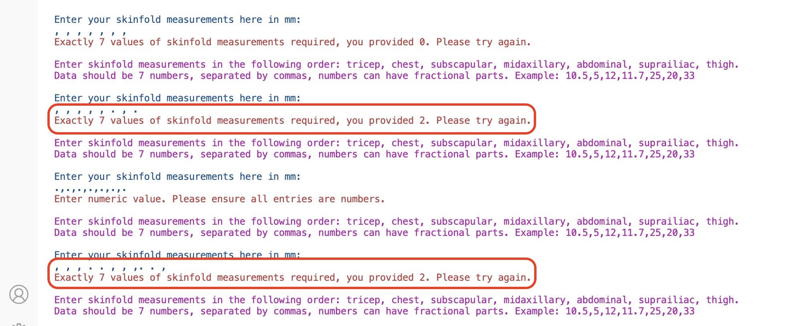

##### ***Solution***

In order to improve the validation process, the following changes were introduced to the code:

- A regular expression pattern was introduced to identify entries consisting solely of non-numeric characters (spaces, dots, or commas) to reject them as invalid.

   ```
   # Pattern to identify entries that are purely non-numeric (e.g., empty, just dots or commas)
   non_numeric_pattern = r"^\s*[\.,]*\s*$"

    # Ensure each entry is not just dots or empty spaces
   if any(re.match(non_numeric_pattern, value) for value in values):
      print(Fore.RED + "Invalid input. Each measurement must be a numerical value, "
      "entries containing only spaces or dots are not accepted.\n")
      return False
   ```     

    This helped to improve the validation process. However, it was noticed that multiple dots and numbers with spaces were identified as a single entry:

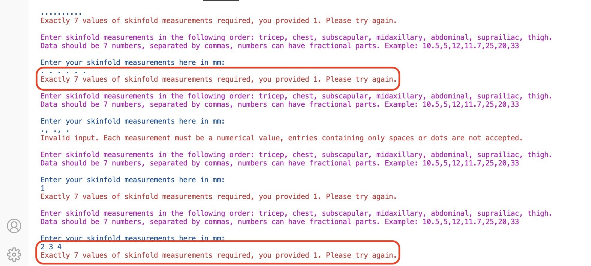

- Therefore, the order of the validation functionality was changed to first check for non-numeric character entries before proceeding to count the number of inputs or convert them to float values, and checking the number of inputs at the end of the function: 

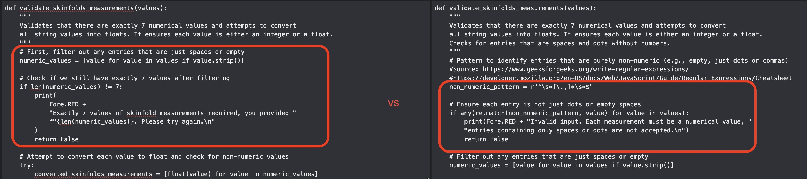

- Furthermore, the input separation method was changed from splitting the input string strictly based on commas:

   ```
   skinfolds_measurements = measurements_str.split(",")
   ```

    To replacing commas with spaces and then splitting the input based on spaces so multiple numbers with spaces were no longer identified as single entries:

    ```
    skinfolds_measurements = measurements_str.replace(",", " ").split()
    ```

This helped to significantly improve the validation process.


### Remaining Bugs
No bugs remaining

### Validator Testing

## Deployment

The calculator app is hosted on Heroku, a container-based cloud platform designed for app development, deployment, and management. It was deployed following the steps below.

Deployment Steps:

1. Log into Heroku Account

2. Create a New App:
   - Click on 'Create new app', enter a name for the app and select a region, then click 'Create app'.

3. Access Settings:
   - Go to the 'Settings' tab of the created app.

4. Configure Environment Variables:
   - Navigate to the 'Config Vars' section to set up environment variables:
     - Click 'Reveal Config Vars'.
     - Add key-value pair to allow connection to API and access the spreadsheet
         - For the KEY, enter `CREDS` in all capital letters.
         - Go to Gitpod workspace, open the `creds.json` file, and copy its content.
         - Paste this content into the 'VALUE' field next to the `CREDS` key on Heroku. Click 'Add'.
     - Add another key-value pair to improve compatibility with Python libraries:
       - KEY: `PORT`
       - VALUE: `8000`

5. Add Buildpacks:
   - Under the 'Settings' tab, locate the 'Buildpacks' section.
   - Click 'Add Buildpack', select 'python', and then 'Save changes'.
   - Repeat the process to add 'nodejs' as another buildpack, ensuring they are in the order: Python followed by NodeJS.

6. Set Up Deployment from GitHub:
   - Switch to the 'Deploy' tab.
   - Choose 'GitHub' as the deployment method and connect to GitHub account.
   - In the search bar, type the repository name `body-fat-percent-calculator` and click 'Search' to find it on GitHub.
   - Click 'Connect' to link the Heroku app to the GitHub repository.

7. Deployment
   - Click on 'Enable Automatic Deploys'
   - Make sure the main branch is selected, then click 'Deploy Branch'
   - Await the build process. Once complete, a message is displayed 'your app was successfully deployed'.

8. View Deployed App:
   - Click on the 'View' button to see the deployed project. 

The deployed project link can be found at the following URL: [Bosy Fat Percent Calculator](https://body-fat-percent-calculator-5ad0ac04aebf.herokuapp.com/).


## Credits

#### Code development
1. Date validation function was developed using [Tutorials Point](https://www.tutorialspoint.com/How-to-do-date-validation-in-Python).

2. User name validation function was developed using [Stack Overflow: Best way to validate a name in Python](https://stackoverflow.com/questions/28495822/best-way-to-validate-a-name-in-python) and [Python 3.12.2 documentation: Regular Expression HOWTO](https://docs.python.org/3/howto/regex.html)

3. To ensure a user does not enter skinfold measurements that exceed maximum possible measurement taken with a skinfold caliper, any function was used utilising the following source [GeeksforGeeks](https://www.geeksforgeeks.org/python-any-function/)

4. To validate Python code [PEP8 Python Validator](https://pep8ci.herokuapp.com), developed by Code Institute was used.

#### Content
1. The body fat percent calculation was done using Jackson/Pollock 7-Site Caliper Method as described on [T.S.K.V. Spartacus](https://tskvspartacus.nl/tools/7-point-fat-percentage-calculator.php)

2. Equipment and procedure instructions, fitness levels breakdown and recomendations were adopted the following sources: [TrainerMetrics](https://www.trainermetrics.com/fitness-assessment-calculations/body-fat-7-site-skinfold-jackson-pollock/) and [Thecalculator.co](https://www.thecalculator.co/health/Body-Fat-Percentage-7-Site-Skinfold-Calculator-1115.html).


#### Fixing errors and bugs

1. To resolve the errors received during code validation through [PEP8 Python Validator](https://pep8ci.herokuapp.com) the following resources from Stack Overflow were used:

- [Stack Overflow: python giving a E501: line too long error](https://stackoverflow.com/questions/53158284/python-giving-a-e501-line-too-long-error?noredirect=1).
- [Stack Overflow: What is PEP8's E128: continuation line under-indented for visual indent?](https://stackoverflow.com/questions/15435811/what-is-pep8s-e128-continuation-line-under-indented-for-visual-indent).
- [Stack Overflow: what is trailing whitespace and how can I handle this?](https://stackoverflow.com/questions/21410075/what-is-trailing-whitespace-and-how-can-i-handle-this).
- [Stack Overflow: PEP8: continuation line over-indented for visual indent](https://stackoverflow.com/questions/21947121/pep8-continuation-line-over-indented-for-visual-indent).
- [Stack Overflow: how to fix the error "E712 comparison to False should be 'if cond is False:' or 'if not cond:'](https://stackoverflow.com/questions/54474042/how-to-fix-the-flake-8-error-e712-comparison-to-false-should-be-if-cond-is-fal).

2. To resolve the issue with Colorama, it was reinstalled using command: ```pip3 install colorama```, following instructions from [Stack Overflow](https://stackoverflow.com/questions/9846683/how-to-install-colorama-in-python).

3. To further address the issues with Colorama, the requirements file was updated utilising instructions from [CopyProgramming](https://copyprogramming.com/howto/heroku-python-failed-to-detect-app-matching-buildpack)

